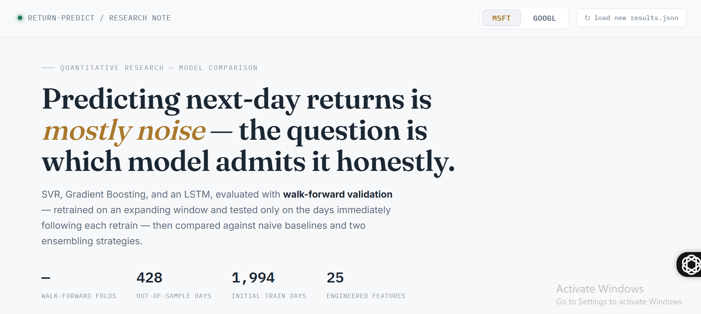
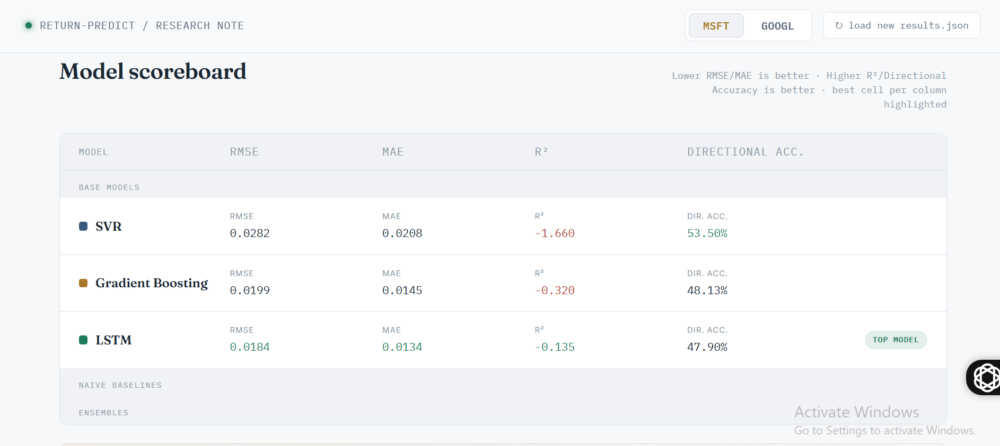

# 📈 Stock Return Prediction Using Machine Learning

A machine learning project where I compare different models for predicting **next-day stock returns** using historical market data.

Instead of trying to make the project look "perfect", I wanted to evaluate the models honestly. I trained and compared **Support Vector Regression (SVR)**, **Gradient Boosting**, and a **PyTorch LSTM**, then tested them using walk-forward validation, model ensembling, SHAP explainability, and a simple trading strategy backtest.

One interesting takeaway from this project was that, on this dataset, a simple baseline ("predict zero return") actually outperformed the ML models in terms of prediction error, and **Buy & Hold** beat every model-driven trading strategy once transaction costs were included. It wasn't the result I expected, but it's an important reminder that financial prediction is extremely challenging.

---

# 🚀 Live Demo

**Live Dashboard**

> 
```
https://stock-prediction-lemon-one.vercel.app
```

---

## Dashboard



---

## Model Comparison



---


# Features

- Download real stock data directly from Yahoo Finance
- Predict next-day returns for **MSFT** and **GOOGL**
- 25 engineered technical indicators
- Compare multiple ML models
- Walk-forward validation
- Naive baseline comparison
- Model ensembling
- SHAP feature importance
- Trading strategy backtesting
- Interactive dashboard

---

# Project Structure

```
stock-return-prediction/
│
├── data/
│   ├── MSFT.csv
│   └── GOOGL.csv
│
├── src/
│   ├── fetch_data.py
│   ├── features.py
│   ├── train_compare.py
│   └── train_advanced.py
│
├── outputs/
│   ├── results.json
│   ├── dashboard.html
│   └── dashboard_dynamic.html
│
└── README.md
```

---

# Getting Started

Clone the repository

```bash
git clone https://github.com/yourusername/stock-return-prediction.git

cd stock-return-prediction
```

Install dependencies

```bash
pip install -r requirements.txt
```

Download stock data

```bash
cd src

python fetch_data.py
```

Run the advanced training pipeline

```bash
python train_advanced.py
```

When training finishes, open

```
outputs/dashboard_dynamic.html
```

If your browser blocks loading the JSON file (which can happen with local HTML files), simply choose `results.json` when the dashboard asks for it.

---

# Models Used

- Support Vector Regression (SVR)
- Gradient Boosting Regressor
- LSTM (PyTorch)

---

# Engineered Features

The model uses around **25 technical features**, including:

- Lagged returns
- Rolling volatility
- Moving averages
- RSI
- MACD
- Bollinger Bands
- Momentum
- Volume features
- High-Low range
- Overnight gap

All features are generated using only past information to avoid data leakage.

---

# Validation Strategy

Rather than relying on one train/test split, the advanced pipeline uses **walk-forward validation**, where the model is repeatedly retrained as new data becomes available.

I also compared every model against two simple baselines:

- Predict Zero Return
- Predict Yesterday's Return

This helps show whether the extra model complexity is actually adding value.

---

# Backtesting

Predicted returns are converted into trading signals (Long / Flat / Short).

The strategy includes:

- Transaction costs
- Equity curve
- Sharpe Ratio
- Maximum Drawdown
- Win Rate

Performance is also compared against a standard **Buy & Hold** strategy.

---

# Explainability

Gradient Boosting predictions are explained using **SHAP**, making it easier to understand which engineered features contributed most to the predictions.

---

# Results

Some highlights from one of my runs:

| Metric                     | MSFT                  | GOOGL                 |
| -------------------------- | --------------------- | --------------------- |
| Lowest RMSE                | Predict Zero Baseline | Predict Zero Baseline |
| Highest Direction Accuracy | Ensemble Stacking     | Ensemble Stacking     |
| Best Trading Performance   | Buy & Hold            | Buy & Hold            |

Since the data is downloaded live from Yahoo Finance, results will change slightly whenever the project is run again.

---

# Tech Stack

- Python
- PyTorch
- scikit-learn
- pandas
- NumPy
- SHAP
- yfinance
- Chart.js

---

# What I Learned

This project taught me a lot about building ML systems beyond simply training a model.

Some of the biggest lessons were:

- Proper time-series validation matters.
- Strong baselines are essential.
- Better prediction metrics don't always lead to better trading performance.
- Financial markets are noisy, making short-term prediction extremely difficult.
- Model explainability helps understand why predictions are made, not just what is predicted.

---

# Future Improvements

Some ideas I'd like to explore later:

- Add Transformer-based models
- Try XGBoost and LightGBM
- Hyperparameter tuning with Optuna
- More technical indicators
- Sentiment analysis using financial news
- Multi-stock portfolio optimization
- Deploy the dashboard online with automatic updates

---

# Author

**Aiman Hafeez**

GitHub:

> https://github.com/Aiman-Hafeez-0

LinkedIn:

> www.linkedin.com/in/aiman-hafeez-

---

If you found this project interesting, feel free to star the repository.
